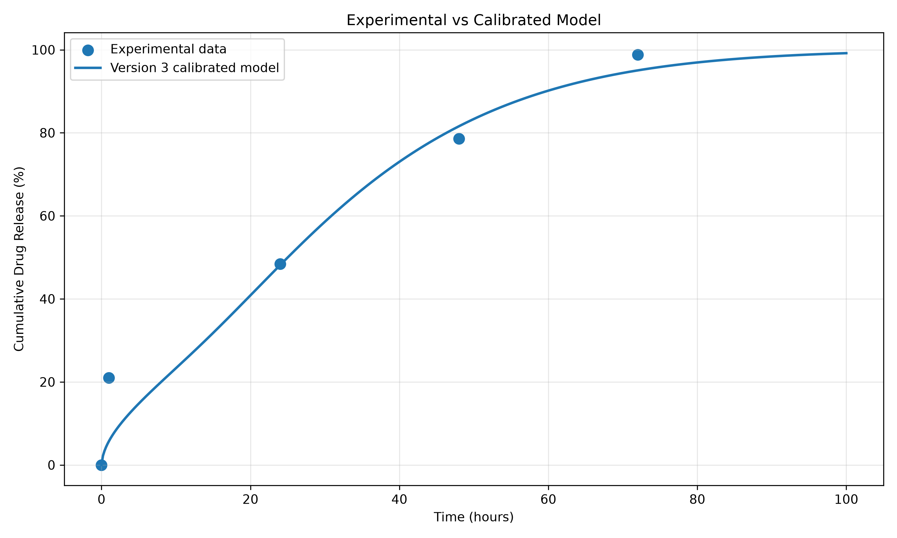
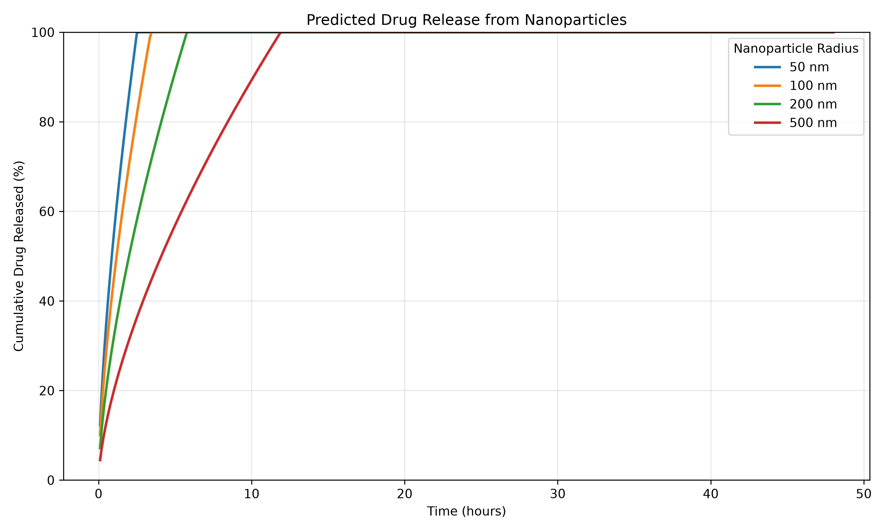
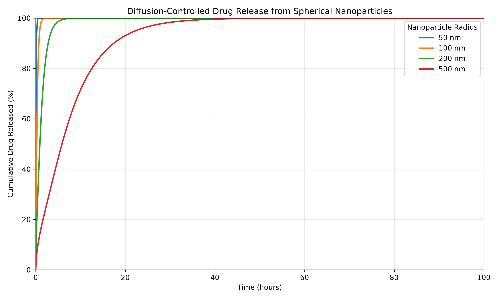
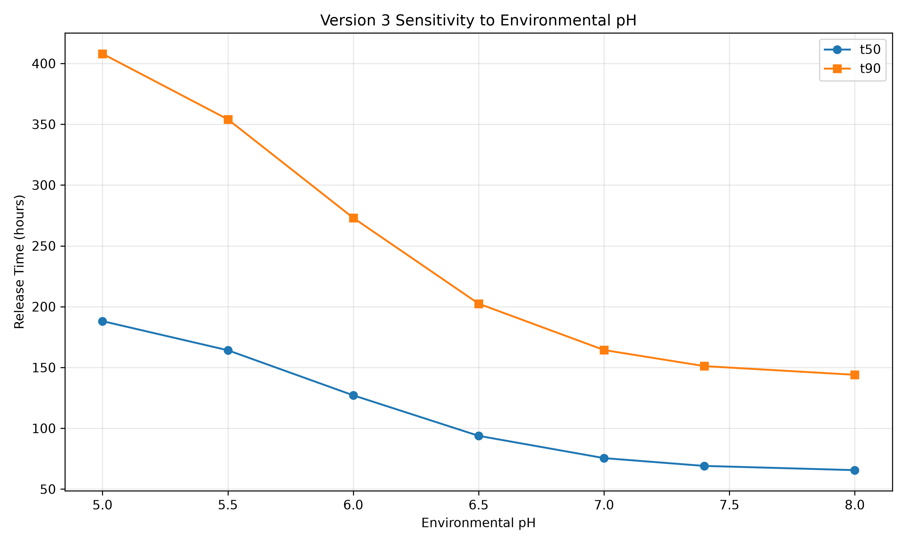
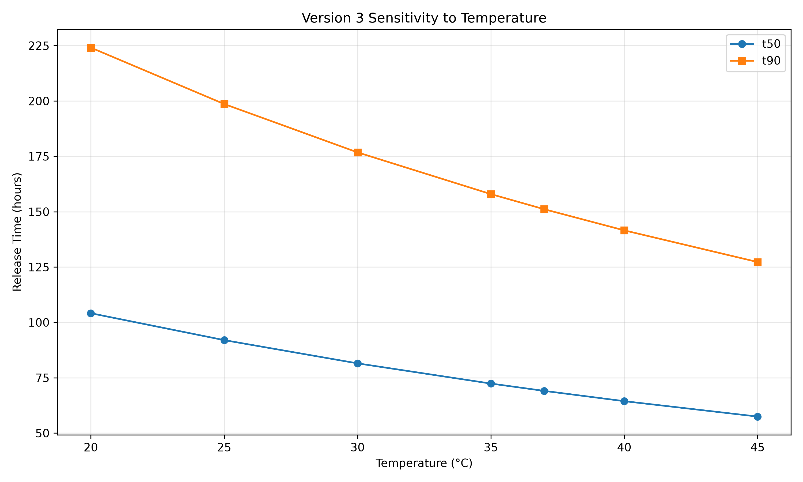
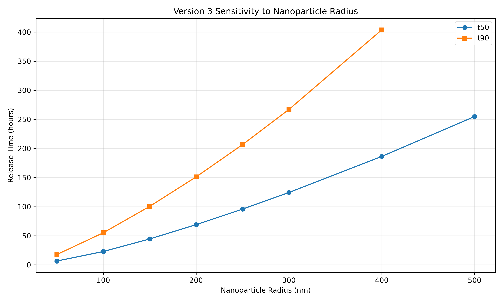
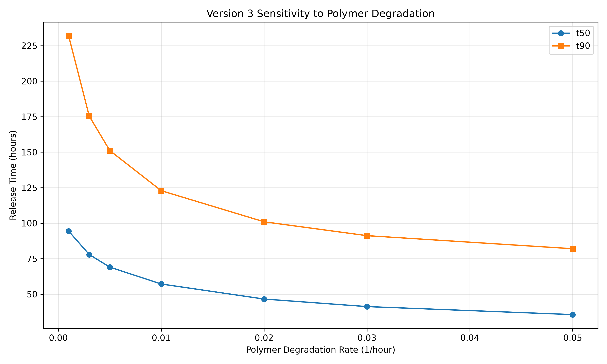

# Nanoparticle Drug Delivery Modeling & Optimization

## Project Overview

This project develops a computational model for predicting controlled drug release from polymeric nanoparticles. The workflow combines mathematical modeling, experimental-data calibration, validation, sensitivity analysis, and parameter optimization to investigate how nanoparticle and environmental properties influence drug-release behavior.

The final calibrated Version 3 model was evaluated against experimental release data and used to identify a low-error parameter configuration within the tested design space.
### Key Results

| Metric | Result |
|---|---:|
| R² | **0.9610** |
| RMSE | **7.144 percentage points** |
| MAE | **4.452 percentage points** |
| Optimized nanoparticle radius | **200 nm** |
| Optimized temperature | **30 °C** |
| Optimized environmental pH | **7.0** |
| Optimized polymer degradation rate | **0.005 1/hour** |
### Key Results

| Metric | Result |
|---|---:|
| R² | **0.9610** |
| RMSE | **7.144 percentage points** |
| MAE | **4.452 percentage points** |
| Optimized nanoparticle radius | **200 nm** |
| Optimized temperature | **30 °C** |
| Optimized environmental pH | **7.0** |
| Optimized polymer degradation rate | **0.005 1/hour** |
# Nanoparticle Drug Delivery Modeling & Optimization

[](https://github.com/jwhite0607/nanoparticle-drug-delivery/actions)
[](#validation)
[](#validation)

## Overview

A computational engineering framework for modeling, validating, and optimizing controlled drug release from polymeric nanoparticles.

The project combines numerical diffusion modeling, temperature and pH effects, polymer degradation, experimental calibration, sensitivity analysis, and parameter optimization.

> **Scope:** This repository contains a computational engineering model. It does not constitute experimental, preclinical, or clinical validation.

---

## Key Results

The calibrated Version 3 model achieved:

| Metric | Result |
|---|---:|
| R² | **0.9610** |
| RMSE | **7.144 percentage points** |
| MAE | **4.452 percentage points** |
| Automated tests | **18 passed** |
| Code coverage | **100%** |

### Optimized Configuration

| Parameter | Value |
|---|---:|
| Nanoparticle radius | **200 nm** |
| Temperature | **30 °C** |
| pH | **7.0** |
| Polymer degradation rate | **0.005 1/hour** |
| Predicted t50 | **13.83 hours** |
| Predicted t90 | **35.07 hours** |
| Optimization error | **4.205** |

---

## Engineering Model

The model represents controlled drug transport from a spherical nanoparticle using a diffusion-based formulation.

### Temperature Dependence

Temperature effects are modeled using an Arrhenius relationship:

\[
D(T)=D_0\exp\left(-\frac{E_a}{RT}\right)
\]

### pH Dependence

A phenomenological ionization model is used to represent pH-dependent diffusion enhancement:

\[
f_{pH}
=
1+
(F_{max}-1)
\frac{1}{1+10^{pK_a-pH}}
\]

### Polymer Degradation

Polymer degradation increases the effective diffusion coefficient over time:

\[
D(t)
=
D_0
\left[
1+
A(1-e^{-kt})
\right]
\]

The resulting system is solved numerically using SciPy's `solve_ivp` differential-equation solver with a BDF integration method.

---

## Model Components

The project includes:

- Spherical Fickian diffusion
- Temperature-dependent diffusion
- pH-dependent diffusion
- Polymer degradation
- Calibrated diffusion parameters
- Experimental comparison
- Sensitivity analysis
- Parameter optimization
- Release-profile generation
- Automated regression testing
- Continuous integration

---

## Results & Visualizations

### Experimental vs. Model



### Release Profiles



### Diffusion Release Profiles



### pH Sensitivity



### Temperature Sensitivity



### Radius Sensitivity



### Degradation Sensitivity



---

## Validation

The project contains an automated `pytest` validation suite covering:

- Release output validity
- Time-array behavior
- Monotonic release behavior
- Nanoparticle radius effects
- Temperature effects
- pH effects
- Polymer degradation effects
- Optimized configuration execution
- Calibrated-release validity

Current validation result:

```text
18 passed
100% code coverage
## Reproducibility

The complete modeling, calibration, validation, sensitivity-analysis, and optimization workflow is implemented in Python and can be reproduced from the command line.

### Install dependencies

```bash
python -m pip install -r requirements.txt